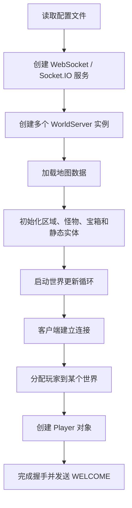
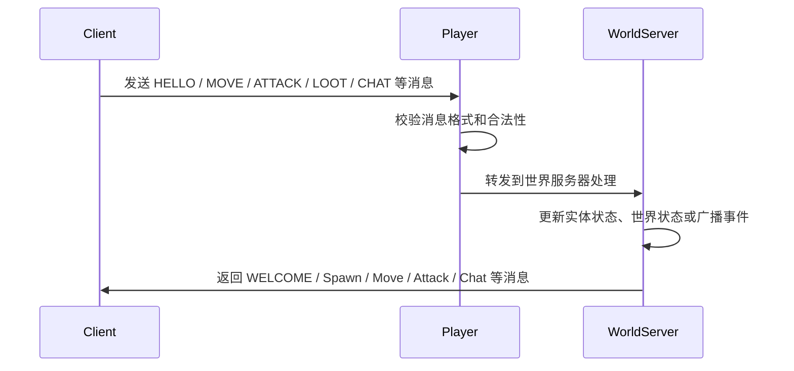
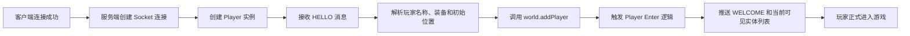

BrowserQuest [updated & with Socket.IO]
============


Changes
============
  * Updated backend and frontend to use Socket.IO server and Client
  * Main changes were made to ws.js and gameclient.js.
  * Updated dependencies such as requirejs and jQuery to their latest versions
  * Fixed build script
  * Created a mini-dispatcher on the server side that provides the IP and Port in the configs as the ones for the game server.
  * Added a demo to http://browserquest.codevolution.com
  * A few minor edits to server side handling

TODO
============
  * Quest system and more awesome features
 


This is my take on Mozilla's amazing multiplayer open source game.

I've yet to find any other game that's so well done from graphics, implementation and features point of view (did I mention open source, multiplayer and browser based?).


I've wanted to use the game for a while and found many of its dependencies to be deprecated and even obsolete.

I've just taken the time to understand the code and thank you guys for making it so well structured.


This now works on the latest Socket.IO. Everything should work just as in the original developers intended.

Enjoy this amazing open source browser based role playing multiplayer 2D game!

And a big thank you to the original developers is in order! THANK YOU!

HOW TO RUN?
============

```
npm install
node server/js/main.js
```

Then go inside the Client folder and open index.html.

You might want to host a webserver and open index.html in that (e.g. 127.0.0.1/index.html).

Also read the original README files you'll find inside the Client and Server folders to learn the basics of configuring (it's preconfigured right now).


Server Flow Diagrams
============

## 启动流程图



这条链路说明了服务端从配置加载到世界运行，再到玩家进入游戏的整体启动过程。

## 消息协议流程图



服务端并不是直接处理所有内容，而是先由 Player 层解析客户端消息，再由 WorldServer 统一进行游戏逻辑更新和广播。

## 玩家进入游戏的完整链路



完整链路可以概括为：
1. 客户端发起连接。
2. 服务端创建 Player 对象并绑定网络连接。
3. 收到 HELLO 后完成角色初始化。
4. 将玩家注册到对应世界中。
5. 触发进入世界逻辑并广播初始状态。
6. 玩家开始参与移动、战斗、聊天和拾取等交互。


Original README
============
BrowserQuest is a HTML5/JavaScript multiplayer game experiment.


Documentation
-------------

Documentation is located in client and server directories.


License
-------

Code is licensed under MPL 2.0. Content is licensed under CC-BY-SA 3.0.
See the LICENSE file for details.


Credits
-------
Created by [Little Workshop](http://www.littleworkshop.fr):

* Franck Lecollinet - [@whatthefranck](http://twitter.com/whatthefranck)
* Guillaume Lecollinet - [@glecollinet](http://twitter.com/glecollinet)
